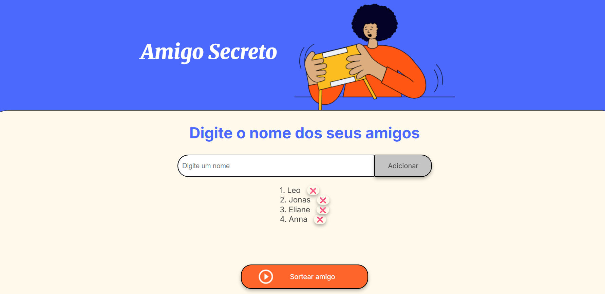

# 🎁 Amigo Secreto

Um simples (mas estiloso) sorteador de Amigo Secreto feito em JavaScript!
Aqui você digita o nome dos seus amigos, adiciona na lista e depois clica no botão mágico para descobrir quem foi sorteado.

Ah, e tem um botão extra de remover nome (porque sempre tem aquele amigo que resolve desistir na última hora, né? 😅).

## 🚀 Funcionalidades

- ✍️ Adicionar amigos digitando o nome na lista
- 🎲 Sortear um amigo secreto de forma totalmente aleatória
- ❌ Remover nomes (funcionalidade bônus que eu adicionei 👨‍💻)
- 🎨 Interface estilizada em HTML + CSS criada pela Equipe Alura

## 🛠️ Ferramentas utilizadas

- **HTML5** → Estrutura da página (Equipe Alura)
- **CSS3** → Estilização bonitona (Equipe Alura)
- **JavaScript** → Toda a lógica de adicionar, listar, remover e sortear amigos 🎯

## 🧠 Técnicas de JavaScript utilizadas

- **Arrays** → Para armazenar a lista de amigos
- **Manipulação de DOM** → Para interagir com elementos HTML
- **Event Listeners** → Para capturar ações do usuário
- **Validação de formulários** → Para evitar campos vazios
- **Métodos de array (push, filter)** → Para adicionar e remover itens
- **Math.random()** → Para gerar números aleatórios no sorteio
- **Manipulação de strings (trim)** → Para limpar dados de entrada
- **Template literals** → Para criar strings dinâmicas

## 💻 Como instalar e executar

1. Clone o repositório:

```bash
git clone https://github.com/seu-usuario/amigo-secreto.git
```

2. Acesse a pasta do projeto:

```bash
cd amigo-secreto
```

3. Abra o arquivo `index.html` no navegador de sua preferência.

> Dica: você pode simplesmente arrastar o arquivo para a janela do navegador 🚀

## 🎬 Demonstração

### 📸 Screenshot:
)

### 🎥 Gif da funcionalidade:
)

## 🤝 Contribuições

Quer contribuir com o projeto? Fico super feliz com isso! 😍

1. Faça um fork do repositório
2. Crie uma branch para sua feature:

```bash
git checkout -b minha-feature
```

3. Faça o commit das suas alterações:

```bash
git commit -m "feat: adicionando minha feature"
```

4. Envie para o seu fork:

```bash
git push origin minha-feature
```

5. Abra um Pull Request 🚀

## 📢 Créditos

- **HTML e CSS**: desenvolvidos pela incrível Equipe Alura 👏
- **Lógica em JavaScript**: desenvolvida por mim 🚀

---

👉 Agora é só rodar e se divertir com seus amigos!
```
